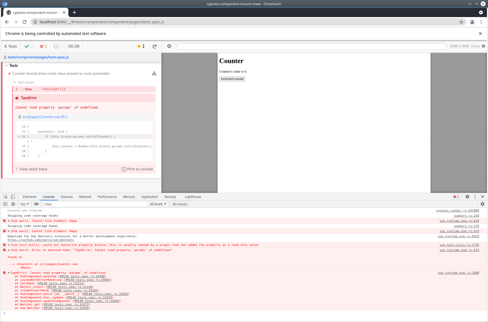

# (Not yet) Minimal Working Example for Cypress Component Mount Issue

This repository should provide a minimal working example for mounting a Vue component with Cypress and mocking the `$route`.

## Problem

When executing a component test with Cypress 6.9.1, the `$route` object cannot be mocked. Furthermore, vue issues an error that `#app` cannot be found. Please note, that `mount` from `@cypress/vue` is used instead of the underlying `@vue/test-utils`.



## Installation

```
npm install
```

## Steps to reproduce

```
# Terminal 1
npm run start

# Terminal 2
npm run test:component
```

Open console of web browser and see errors.
